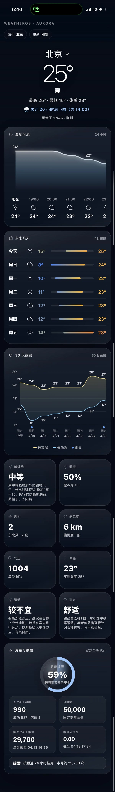

# WeatherOS · Aurora Edition

一个基于和风天气 API 的轻量级天气查询服务，支持实时天气、24 小时预报、7 天预报、30 天趋势、灾害预警、控制台统计等功能。

## 功能特性

- 🌤 实时天气查询
- 📅 24 小时 / 7 天 / 30 天预报
- ⚠️ 天气灾害预警
- 🌍 城市搜索与定位
- 📊 控制台统计与财务概览（JWT 认证）
- 🔒 前端邀请码保护（支持环境变量配置）

## 界面预览

<p align="center">
  
  
  
</p>

## 技术栈

- **后端**: Python + Flask
- **前端**: 原生 HTML/JS + Tailwind CSS
- **API**: 和风天气 QWeather

## 快速开始

### 1. 克隆仓库

```bash
git clone https://github.com/YOUR_USERNAME/weatheros.git
cd weatheros
```

### 2. 创建虚拟环境

```bash
python3 -m venv .venv
source .venv/bin/activate  # Linux/macOS
# .venv\Scripts\activate   # Windows
```

### 3. 安装依赖

```bash
pip install flask pyjwt requests python-dotenv
```

### 4. 配置环境变量

```bash
cp .env.example .env
```

编辑 `.env`，填入以下配置：

| 变量名 | 说明 | 必填 |
|--------|------|------|
| `QW_API_HOST` | 和风天气 API 域名 | ✅ |
| `QW_API_KEY` | 和风天气 API Key | ✅ |
| `QW_KEY_ID` | 控制台 Key ID（用于 JWT） | ✅ |
| `QW_PROJECT_ID` | 控制台 Project ID（用于 JWT） | ✅ |
| `QW_PRIVATE_KEY_FILE` | Ed25519 私钥文件路径 | ✅ |
| `INVITE_CODE` | 前端访问邀请码 | ✅ |
| `PORT` | 服务端口（默认 8787） | ❌ |
| `JWT_EXPIRE_SECONDS` | JWT 过期时间（默认 900） | ❌ |

> **注意**：`.env` 和 `*.pem` 已加入 `.gitignore`，请勿手动提交到仓库。

### 5. 启动服务

**完整功能模式（推荐）**：

```bash
python weatheros_backend.py
```

- 自动读取 `.env` 中的 `INVITE_CODE` 并注入到前端页面
- 提供 `/api/*` 天气数据代理接口
- 支持 JWT 认证的控制台统计接口

**纯静态预览模式**：

```bash
bash start.sh
```

- 仅启动静态文件服务器（`python3 -m http.server`）
- 前端邀请码不会被注入（页面中的 `__INVITE_CODE__` 保持原样）
- 天气数据 API 不可用
- 仅用于前端 UI 预览

## 和风天气配置

1. 前往 [和风天气控制台](https://console.qweather.com/) 注册账号
2. 创建项目并获取 **API Key**
3. 在「KEY 管理」中创建 **Ed25519 密钥对**，下载私钥（如 `ed25519-private.pem`）
4. 将私钥放入项目目录，并在 `.env` 中配置 `QW_PRIVATE_KEY_FILE`

## 项目结构

```
.
├── weatheros_backend.py      # Flask 后端服务（API 代理 + 页面渲染）
├── index-backend-proxy.html  # 前端页面（模板，由后端注入变量）
├── start.sh                  # 纯静态服务器启动脚本
├── JWT-fixed.py              # JWT 调试工具（独立脚本）
├── .env.example              # 环境变量模板
└── .gitignore                # Git 忽略规则
```

## 部署方式

### 本地开发

```bash
python weatheros_backend.py
```

### 后台运行（简易）

```bash
# 使用 nohup 放到后台
nohup python weatheros_backend.py > backend.log 2>&1 &

# 查看日志
tail -f backend.log

# 停止服务
ps aux | grep weatheros_backend
kill <PID>
```

### 后台运行（systemd，推荐 Linux 服务器）

创建服务文件 `/etc/systemd/system/weatheros.service`：

```ini
[Unit]
Description=WeatherOS Backend
After=network.target

[Service]
Type=simple
User=www-data
WorkingDirectory=/opt/weatheros
Environment="PATH=/opt/weatheros/.venv/bin"
ExecStart=/opt/weatheros/.venv/bin/python weatheros_backend.py
Restart=on-failure
RestartSec=5

[Install]
WantedBy=multi-user.target
```

启用并启动：

```bash
sudo systemctl daemon-reload
sudo systemctl enable weatheros
sudo systemctl start weatheros
sudo systemctl status weatheros
```

### 使用 Gunicorn（生产环境）

```bash
pip install gunicorn

# 启动（4 个 worker，绑定 0.0.0.0:8787）
gunicorn -w 4 -b 0.0.0.0:8787 weatheros_backend:app
```

### 公网访问

使用 Cloudflare Tunnel、frp、ngrok 等反向代理暴露服务。或配合 Nginx 做反向代理 + HTTPS：

```nginx
server {
    listen 80;
    server_name weather.example.com;
    return 301 https://$host$request_uri;
}

server {
    listen 443 ssl;
    server_name weather.example.com;

    ssl_certificate /path/to/cert.pem;
    ssl_certificate_key /path/to/key.pem;

    location / {
        proxy_pass http://127.0.0.1:8787;
        proxy_set_header Host $host;
        proxy_set_header X-Real-IP $remote_addr;
    }
}
```

## 安全说明

- `.env` 和 `*.pem` 文件已加入 `.gitignore`，不会上传到仓库
- 邀请码通过 `INVITE_CODE` 环境变量配置，由后端渲染注入页面，前端无硬编码
- 生产环境建议：
  - 使用 HTTPS
  - 限制 API Key 的调用 IP
  - 定期轮换 JWT 密钥

## License

本项目基于 [MIT License](LICENSE) 开源。

[](https://opensource.org/licenses/MIT)
